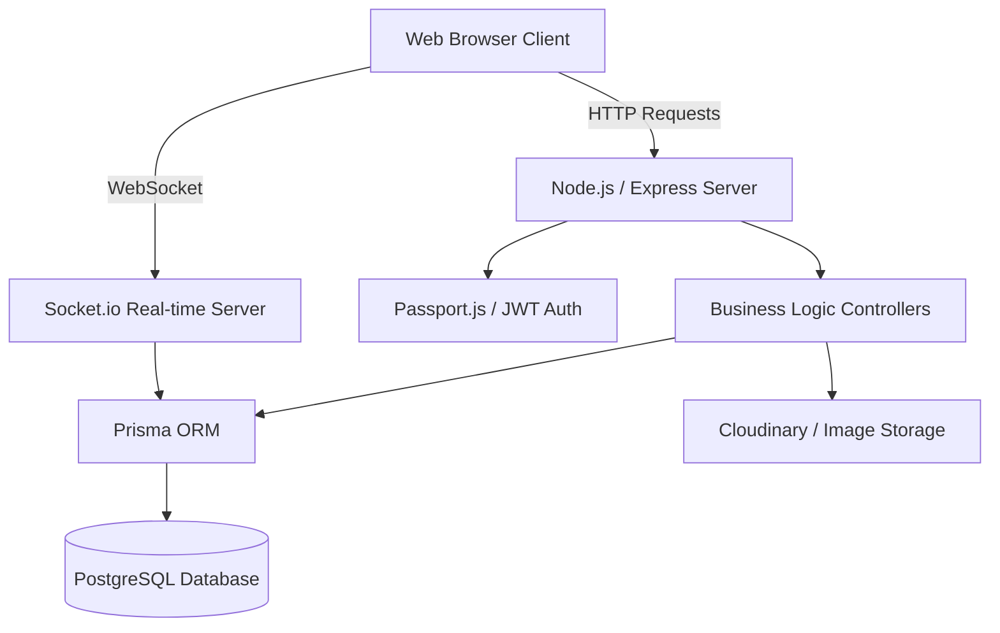
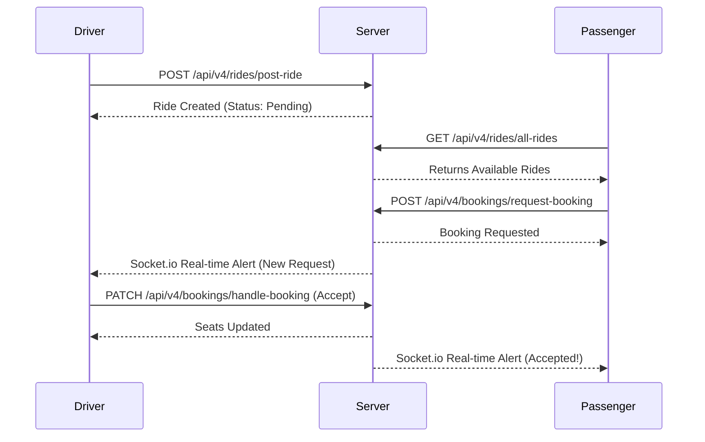

# RideMitra: Complete Project Architecture & Explanation

> **RideMitra** is a modern, real-time ride-sharing ecosystem. This document serves as a comprehensive technical explanation of the platform's architecture, data flow, and underlying mechanics.

## 1. High-Level Architecture
The application follows a client-server architecture, using EJS for server-side rendering and a Node.js/Express REST API. Real-time features are powered by Socket.io, backed by a PostgreSQL database via Prisma ORM.

---

## 2. Core Entities & Data Model

The application uses **PostgreSQL** with a highly structured schema. Below is an explanation of the primary entities:

| Model | Purpose | Key Relationships |
| :--- | :--- | :--- |
| **User** | Represents both Drivers and Passengers. Handles authentication, profiles, and roles. | 1:N with Rides, Bookings, Notifications, Messages. |
| **Ride** | Created by Drivers. Contains trip details like source, destination, fare, and seats. | N:1 with User (Driver), 1:N with Bookings. |
| **Booking** | Represents a Passenger's request to join a Ride. Contains status tracking. | N:1 with Ride, N:1 with User (Passenger). |
| **Notification** | Real-time system alerts triggered by booking status changes. | N:1 with User, N:1 with Booking. |

> [!IMPORTANT]
> The database was successfully migrated from MongoDB (NoSQL) to PostgreSQL (Relational) to provide stricter data integrity using foreign keys and cascading updates.

---

## 3. Key Workflows

### A. Authentication Flow
RideMitra uses a dual-authentication strategy to ensure security and convenience:
1. **Traditional Login:** Email/password hashed with `bcryptjs`. Generates a stateless JWT.
2. **OAuth 2.0:** Integrated with Google via `passport-google-oauth20` for seamless 1-click onboarding.

### B. The Ride Lifecycle

### C. Real-Time Communication
The `Socket.io` integration is crucial for the platform's user experience. Instead of forcing users to refresh pages, the server pushes events:
- **Notifications:** When a driver accepts/rejects a ride, the passenger receives an instant browser notification.
- **Messaging:** Passengers and drivers can chat contextually within a specific `Booking` interface using WebSockets.

---

## 4. API Endpoints Overview

> [!TIP]
> All protected routes expect an `Authorization: Bearer <token>` header, derived from the login response.

| Category | Key Endpoints | Description |
| :--- | :--- | :--- |
| **Users** | `POST /api/v4/user/register` `GET /api/v4/user/me` | Handles account creation, profile fetching, and Google OAuth interactions. |
| **Rides** | `POST /api/v4/rides/post-ride` `GET /api/v4/rides/all-rides` | Allows drivers to publish rides and passengers to query them using filters (pickup, destination, date). |
| **Bookings** | `POST /api/v4/bookings/request-booking` `PATCH /api/v4/bookings/handle-booking/:id` | The transaction layer where passengers request seats and drivers approve/deny them. |
| **Views** | `GET /dashboard` `GET /find-ride` | EJS-powered routes that serve dynamic HTML pages directly to the browser. |

---

## 5. Security & Optimizations

- **File Uploads:** Profile pictures and assets are uploaded via `multer` and streamed directly to `Cloudinary`, keeping the local server lightweight.
- **Protection:** 
  - `helmet` secures Express apps by setting various HTTP headers.
  - `express-rate-limit` prevents brute-force attacks on sensitive routes like login.
- **Validation:** Incoming API payloads are strictly validated using `zod` to prevent malformed data from reaching the database.
